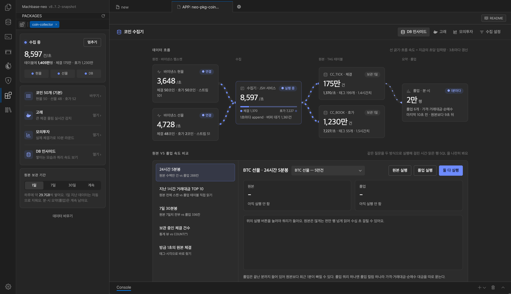

# 코인 수집기 (neo-pkg-coin-collector)

[English](README.md) | [한국어](README.ko.md) | [日本語](README.ja.md)

바이낸스 USDT 마켓에서 고른 코인의 **현물·선물 체결과 호가 변화를 실시간으로 받아 Machbase 에 쌓는** machbase-neo 패키지입니다.

- 체결은 분·시 **롤업**(시가·고가·저가·종가·거래대금)을 함께 쌓아, 원본을 지운 뒤에도 긴 기간의 캔들을 바로 볼 수 있어요.
- 같은 체결로 **고래**(1초 동안 평소보다 크게 몰린 매수·매도)를 감지해 기록하고 알려 줘요.
- 실제 체결가로 겨루는 **모의투자** 게임이 들어 있어요.
- **DB 인사이드** 화면에서 데이터가 어떻게 쌓이고, 원본과 롤업 쿼리가 얼마나 빠른지 바로 볼 수 있어요.

설치하면 바로 거래대금 상위 50개 코인을 수집하기 시작하고, 수집할 코인은 화면에서 언제든 바꿀 수 있어요.



## 요구 사항

- machbase-neo 8.7.0 이상
- 서버가 바이낸스(`stream.binance.com`, `fstream.binance.com`)에 접속할 수 있어야 해요
- 수집 설정 화면을 여는 브라우저도 바이낸스 공개 API(`api.binance.com`, `fapi.binance.com`)에 접속할 수 있어야 코인 목록이 나와요
- 디스크: 기본 50개 구성이면 하루 약 17GB 가 쌓여요. 원본 보관 기간을 1일(기본값)로 두길 권해요

## 설치

1. 이 저장소에서 zip 파일을 받아요 — **Code → Download ZIP**, 또는 **Releases** 의 zip
2. 받은 zip 을 **압축을 풀지 말고 그대로** machbase-neo 가 설치된 폴더의 `public/` 아래에 둬요
   ```
   <machbase-neo 설치 폴더>/
   ├── machbase-neo
   └── public/
       └── neo-pkg-coin-collector-main.zip   ← 여기
   ```
3. machbase-neo 웹 UI 에서 **앱스토어** 를 열고 목록을 새로고침한 뒤 `neo-pkg-coin-collector` 의 **Install** 을 눌러요
4. 설치가 끝나면 수집 서비스가 바로 시작돼요. 앱스토어 카드의 스위치로 켜고 끌 수 있어요

### 업데이트

새 zip 을 `public/` 에 두고 앱스토어에서 **Update** 를 눌러요. 수집 코인·보관 기간 같은 설정과 쌓인 데이터는 그대로 남아요.
같은 이름·버전의 zip 이 `public/` 에 두 개 있으면 설치가 실패하니, 예전 zip 은 지워 주세요.

### 삭제

앱스토어에서 **Uninstall** 을 누르면 수집 서비스가 멈추고 등록이 지워져요. **쌓인 테이블은 남아요** — 필요 없으면
`DROP TABLE CC_TICK CASCADE` 처럼 직접 지워요 (테이블 목록은 아래 [쌓이는 데이터](#쌓이는-데이터)).

## 화면

패키지 탭 위쪽 메뉴로 네 화면을 오가요. 오른쪽 사이드 패널에는 수집 상태와 제어가 있어요.

### DB 인사이드 (첫 화면)

- **데이터 흐름** — 바이낸스 → 수집기 → 테이블 → 롤업으로 지금 초당 몇 건이 흐르는지
- **원본 vs 롤업 속도 비교** — 같은 질문(예: 24시간 5분봉)을 원본 집계와 롤업으로 실행해 걸린 시간·읽은 행·SQL 을 나란히.
  코인을 골라 실행할 수 있어요. 원본 쿼리는 수십 초 걸릴 수 있어 버튼을 눌러야 돌아요
- **저장 구조** — 테이블·롤업마다 행 수와 최근 1시간 적재 추이
- **데이터 수명** — 원본은 보관 기간만큼, 롤업은 계속 남는 모습
- **실시간 부하** — 초당 입력, 테이블 행 수, 롤업 지연, 조회 시간

### 고래

- 같은 코인·같은 방향 체결을 1초 동안 합친 금액이 **24시간 평균 초당 거래대금의 30배 이상이고 $50K 이상**이면 고래로 기록해요.
  화면을 켜 두지 않아도 수집기가 기록해요
- 새 고래가 오면 알림이 뜨고, 소리도 켤 수 있어요
- 차트의 점이나 기록을 누르면 그 순간 앞 1분 ~ 뒤 2분을 1초 단위로 확대해요
- 단건 $10K 이상 큰 체결 목록도 함께 보여요

### 모의투자

- 10분 라운드(:00, :10 …)를 모두가 같이 해요. 라운드마다 $10,000 로 시작하고, 로그인 없이 닉네임만 정해요
- 수집 중인 코인 중 하나를 골라 롱·숏, 레버리지 1·2·5·10배로 진입해요. **체결가는 수집기가 받은 실제 바이낸스 체결가**예요
- 손실이 증거금에 닿으면 청산돼요 (가격이 잠깐 찍고 돌아와도 청산)
- 고래가 나타나면 **따라 타기** 버튼으로 같은 방향 주문표를 채울 수 있어요
- 라운드가 끝나면 시상대와 우승자 자산 곡선, 고래를 따라간 사람과 안 따라간 사람의 평균 수익률을 보여 줘요

### 수집 설정

- 바이낸스 USDT 마켓(현물 약 500개, 선물 약 520개)을 거래대금 순으로 보여 줘요. 검색하거나 "거래대금 상위 N개 추가" 로 고를 수 있어요
- 코인마다 **현물 체결 / 현물 호가 / 선물 체결 / 선물 호가** 를 따로 켜요. 아래 줄에 예상 부하(초당 체결·호가)가 나와요
- **저장하고 적용** 을 누르면 수집기가 2초 안에 새 목록으로 받기 시작해요 (재시작 없음). 뺀 코인의 지난 데이터는 남아요
- **기본 구성으로** — 처음 설치 때의 50개 구성으로 돌아가요

### 사이드 패널

- 수집 중인지, 초당 몇 건 들어오는지, 테이블에 몇 행이 있는지. **수집 시작 / 멈추기** 버튼
- **원본 보관 기간** — 1일 · 7일 · 30일 · 계속. 지금 속도로 하루에 얼마나 쌓이는지도 보여 줘요. 롤업은 보관 기간과 관계없이 계속 남아요
- **데이터 비우기** — 체결·호가 원본과 롤업을 지우고 빈 테이블로 다시 만들어요. 수집 중이었으면 이어서 수집하고,
  멈춰 있었으면 멈춘 그대로예요. 호가가 수억 행이면 몇 분 걸릴 수 있어요

## 쌓이는 데이터

| 테이블 | 종류 | 내용 |
|---|---|---|
| `CC_TICK` | TAG | 체결 원본. `VALUE` 체결가, `QTY` 수량(매수 +, 매도 −), `AMT` 거래대금, `SAMT` 순매수 대금, `TRADE_ID` |
| `_CC_TICK_ROLLUP_MIN` · `_HOUR` | 롤업 | 가격 분·시 요약 (시가·고가·저가·종가·건수) |
| `_CC_TICK_AMT_MIN` · `_HOUR` | 롤업 | 거래대금 분·시 합계 |
| `_CC_TICK_SAMT_MIN` · `_HOUR` | 롤업 | 순매수 대금 분·시 합계 (매수 대금 = (AMT+SAMT)/2, 매도 대금 = (AMT−SAMT)/2) |
| `CC_BOOK` | TAG | 호가 변화 원본. 0.1초마다 바뀐 가격 단계마다 1행. `VALUE` 호가 가격, `QTY` 새 잔량(0 이면 사라짐), `SIDE` 1 매수·−1 매도 |
| `CC_WHALE` | LOG | 고래 기록 (시각, 코인, 방향, 금액, 평소의 몇 배, 체결 수) |
| `CC_GAME_ORDER` · `CC_GAME_EQUITY` · `CC_GAME_RESULT` | LOG · TAG · LOG | 모의투자 주문, 참가자 자산 1초 기록, 라운드 결과 |

태그 이름은 현물 `BINANCE.BTCUSDT`, 선물 `BINANCE_F.BTCUSDT` 예요. `1000PEPEUSDT` 처럼 1000개 단위인 선물 계약은
현물과 같은 단위로 바꿔 `BINANCE_F.PEPEUSDT` 로 저장해요 (가격 ÷ 1000, 수량 × 1000).

```sql
-- BTC 선물 최근 1시간 1분봉 (롤업 — 원본을 읽지 않아요)
SELECT ROLLUP('min', 1, TIME) AS M, FIRST(TIME, VALUE) AS O, MAX(VALUE) AS H, MIN(VALUE) AS L, LAST(TIME, VALUE) AS C
  FROM CC_TICK WHERE NAME = 'BINANCE_F.BTCUSDT' AND TIME >= NOW - 1h GROUP BY M ORDER BY M;

-- 오늘 가장 큰 고래 10건
SELECT WHALE_AT, NAME, SIDE, AMOUNT_USD, RATIO FROM CC_WHALE
  WHERE WHALE_AT >= NOW - 1d ORDER BY AMOUNT_USD DESC LIMIT 10;
```

## 설정 파일

모두 `<machbase-neo 설치 폴더>/public/neo-pkg-coin-collector/cgi-bin/conf.d/` 에 두고, 업데이트해도 유지돼요.

| 파일 | 내용 |
|---|---|
| `markets.json` | 수집할 코인. 수집 설정 화면이 만들어요 — 직접 고칠 일은 없어요 |
| `whale.json` | 고래 기준. `{ "ratio": 30, "minUsd": 50000 }` — 바꾼 뒤 앱스토어 스위치로 수집을 껐다 켜요 |
| `db.json` | 다른 Machbase 에 쌓고 싶을 때만. `{ "host": "...", "port": 5656, "user": "sys", "password": "..." }`. 없으면 이 서버에 쌓아요 |

개발·구조 메모는 [docs/DEVELOPMENT.md](docs/DEVELOPMENT.md) 에 있어요.
